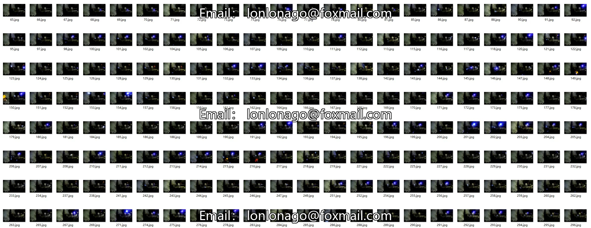
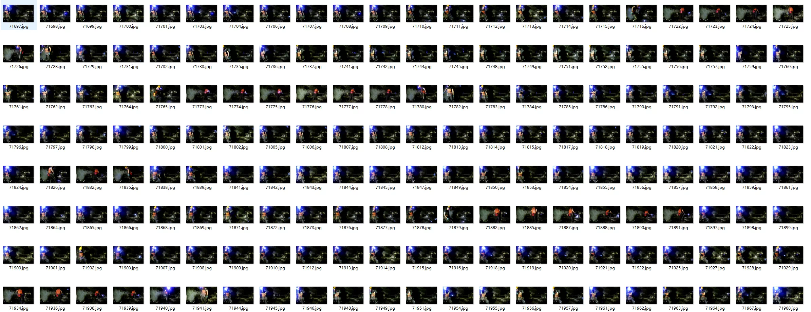
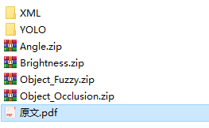
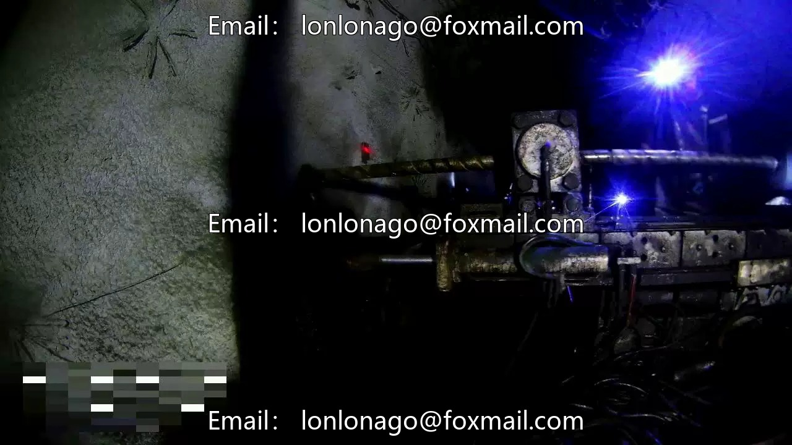
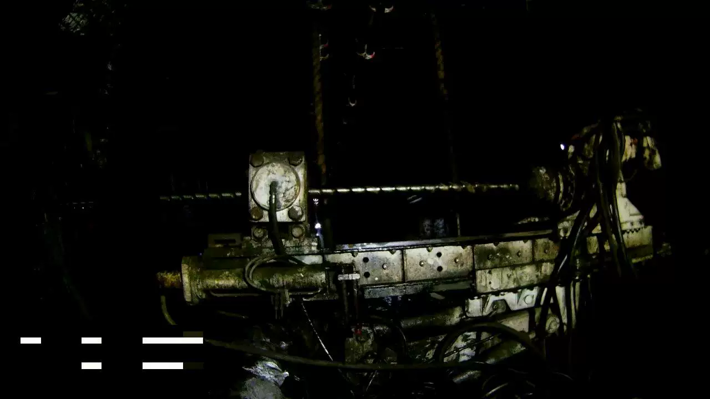
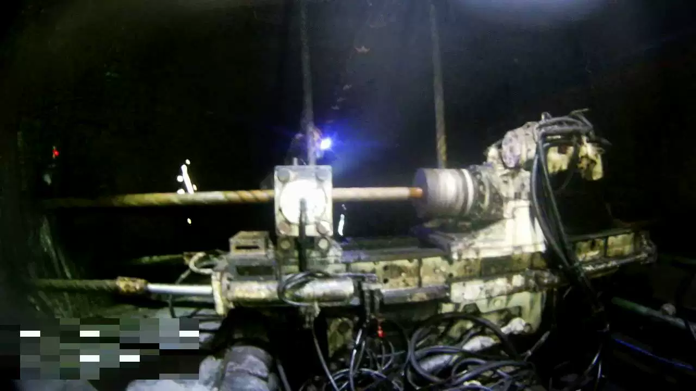

## Body

Coal Mine Underground Drilling Spot Target Detection Dataset in YOLO XML Format

The coal mine underground drilling spot target detection dataset contains 70,948 images from different drilling sites and environmental background conditions.

It covers five categories of targets: gripper, drill chuck, coal miner, safety helmet, and drill rod.

"gripper", "drill_pipe", "chuck", "coal_miner", "safety_helmet"

Pascal VOC format annotation files and YOLO annotation files are provided.

The YOLO annotation files have been divided into training set (49,607), test set (14,320), and validation set (7,021) according to the ratio of 7:2:1.

This dataset can provide strong data support for research on target detection in coal mine underground drilling spots, and play an important role in promoting intelligent monitoring and early warning in coal mine underground.

Source article:
Electronic virtual products sold without return or exchange.

## Images

item_1059904001325

Here is a pay link on Stripe ( https://buy.stripe.com/3cs8yP7sY87d0vu9AB ). Please contact me lonlonago@foxmail.com after funding $89, and I will send you a complete data files , thank you!

